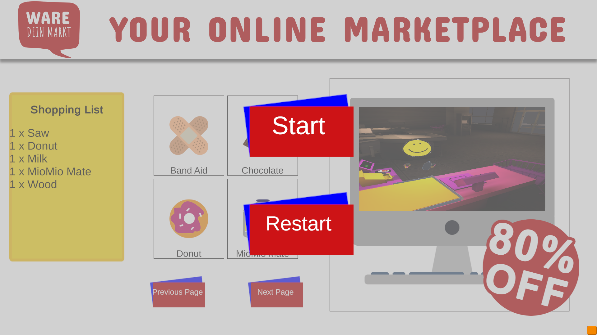

# Dont Repair Buy New
[Global Game Jam Profile](https://globalgamejam.org/2020/games/dont-repair-buy-new-9)
> Created during the Global Game Jam 2020 with 4 other people.

> Don't Repair Buy New is a 2 Player VR Game set in a Super Market.  
> One player takes the role of the customer and needs to complete his shopping list.  
> The other player takes the role of the cashier and needs to scan the products the customer wants to buy.  
> Everything from the shopping list needs to be bought within 20 seconds.
 

### Notes: 
> In order to play the game, you will need the Oculus Quest VR Headset and Controllers.